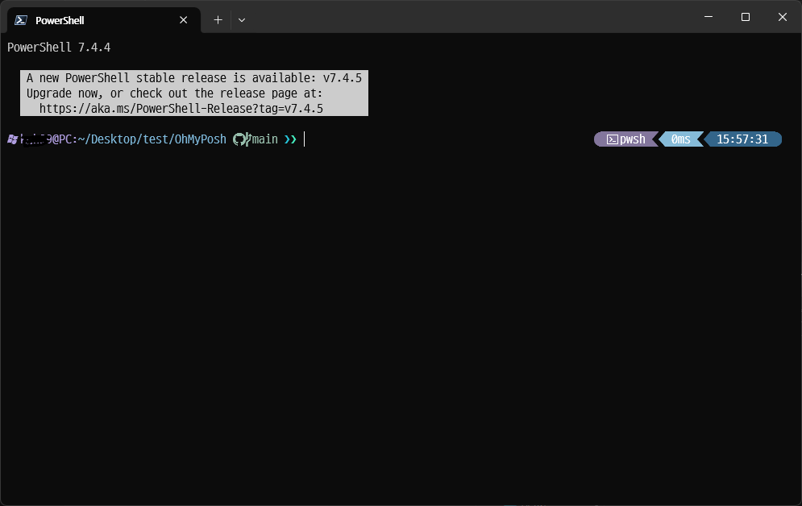

# OhMyPosh custom theme



## Installation

install Oh My Posh
    - https://ohmyposh.dev/docs/installation/windows

## Fonts

install D2Coding Nerd Patch
    - https://github.com/kelvinks/D2Coding_Nerd

## Configuration
1. Create Profile
    ``` New-Item -Path $PROFILE -Type File -Force```
2. Open Profile
    ``` notepad $PROFILE```
3. Edit Profile
    ```oh-my-posh init pwsh --config 'https://raw.githubusercontent.com/zzl-hyun/OhMyPosh/refs/heads/main/0_myCustom.omp.json.json' | Invoke-Expression```
4. Apply
    ```. $PROFILE```